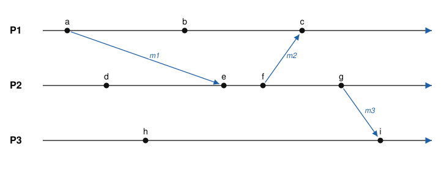
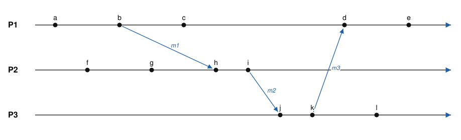
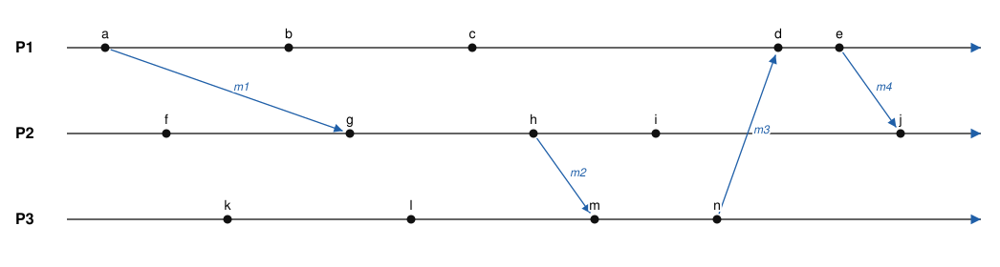
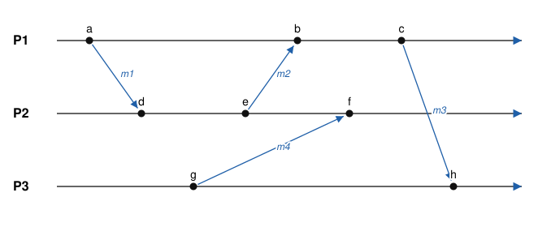

# Temps et causalité : horloges de Lamport, vectorielles et matricielles

Dans un système réparti, il n'y a **ni mémoire commune ni horloge commune**. Pourtant, beaucoup de problèmes exigent de savoir « qui est passé avant qui » :

- une banque qui applique un dépôt puis un retrait sur deux répliques ;
- un chat de groupe où une réponse ne doit pas s'afficher avant sa question ;
- un débogueur qui reconstitue une exécution à partir des journaux de plusieurs machines.

Ce TD cherche à répondre à trois questions :

1. Que veut-on vraiment ordonner, et pourquoi l'heure des machines ne suffit-elle pas ?
2. Que garantit l'horloge de Lamport, et surtout, **que ne garantit-elle pas** ?
3. Comment les horloges vectorielles, puis matricielles, lèvent-elles ces limites, et à quel prix ?

| Fichier | Rôle |
|---|---|
| `horloges.py` | Les quatre horloges (physique, Lamport, vectorielle, matricielle), avec la même interface |
| `reseau.py` | Des processus qui s'échangent des messages UDP. Un observateur omniscient compare les estampilles à la causalité réelle |
| `scenario.py` | Calcule les estampilles d'un scénario écrit à la main et dessine son diagramme espace-temps (SVG) |
| `exercices/` | Scénarios et diagrammes des exercices |

Prérequis : Python ≥ 3.10, aucune bibliothèque externe.

---

## Introduction : processus, messages et événements

### Le modèle

Un système réparti est un ensemble de **processus** P1, P2…, Pn : des programmes qui s'exécutent sur des machines différentes (ou, dans ce TD, dans des threads différents d'une même machine). Chaque processus :

- est **séquentiel** : il fait une chose après l'autre, dans un ordre qu'il connaît parfaitement (question : au sens de quoi ? Que signifie « connaître l'ordre » sans horloge ?) ;
- a sa **propre mémoire**, que les autres ne peuvent pas lire ;
- a sa **propre horloge**, qui n'a aucune raison d'indiquer la même heure que celle des voisins. Historiquement, pourquoi a-t-on eu besoin de connaître l'heure ? Autrement dit, à quel moment de l'histoire de l'humanité le temps est-il devenu important ?

Le seul moyen pour un processus d'apprendre quelque chose sur un autre est de recevoir un **message** de sa part. Un message met un temps inconnu et variable à arriver : on sait seulement qu'il finit par arriver. Deux messages envoyés dans un certain ordre peuvent même arriver dans l'ordre inverse.

La vie d'un processus est une suite d'**événements**, de trois types :

| Type | Exemple | Ce qui se passe |
|---|---|---|
| **Interne** | écrire dans un fichier, faire un calcul | le processus change son état, sans communiquer |
| **Envoi** | `sendto(m1, P2)` | un message part vers un autre processus |
| **Réception** | `recvfrom()` reçoit m1 | un message arrive ; son contenu devient connu du processus |

À chaque message correspondent exactement deux événements : son envoi par l'émetteur, et sa réception par le destinataire.

### Le diagramme espace-temps

On représente une exécution par un **diagramme espace-temps** :



- chaque processus est une ligne horizontale, et son temps local s'écoule de gauche à droite ;
- chaque point est un événement ;
- chaque flèche est un message, qui va de l'événement d'envoi à l'événement de réception. Elle est inclinée, parce que le transport prend du temps.

Dans cet exemple, P1 envoie m1 à P2 (événement a), fait un calcul interne (b), puis reçoit m2 (c). P2 a un événement interne (d), reçoit m1 (e), puis envoie m2 à P1 (f) et m3 à P3 (g). P3 a un événement interne (h), puis reçoit m3 (i).

**Attention** : seule la position d'un événement **sur sa propre ligne** a un sens. Comparer des positions horizontales entre deux lignes n'a pas de sens : h est dessiné à gauche de b, mais rien ne dit que h a eu lieu avant b. Personne, dans le système, ne peut d'ailleurs le savoir, puisqu'aucun message ne relie ces deux événements.

**Dans le code** : dans `reseau.py`, un processus est un thread muni d'une socket UDP, et un message est un datagramme. Dans `scenario.py`, un processus est une ligne de texte qui liste ses événements dans l'ordre local. Le diagramme ci-dessus est produit à partir de `exercices/intro.txt` :

```
P1: a>m1 b c<m2        a>m1 : envoi de m1 ;  c<m2 : réception de m2
P2: d e<m1 f>m2 g>m3   b, d, h : événements internes
P3: h i<m3
```

```bash
python3 scenario.py exercices/intro.txt --svg intro.svg
```

**Questions**

- **I1.** Dans le diagramme, P3 peut-il savoir que l'événement a a eu lieu ? Et l'événement d ? Justifiez en suivant les flèches.
- **I2.** P1 peut-il savoir si h a eu lieu avant ou après b ?
- **I3.** Dessinez à la main une exécution possible de trois processus où P2 envoie deux messages à P3, et où P3 les reçoit dans l'ordre inverse de leur envoi.

---

## Partie 0 : pourquoi pas l'heure des machines ?

```bash
python3 reseau.py physique
```

Chaque processus estampille ses événements avec sa propre horloge, qui a un décalage de ±30 ms et une dérive de ±5 %. Les messages mettent entre 0 et 50 ms à arriver. Le journal est ensuite trié par estampille, et le symbole ⚠ signale une réception placée **avant** l'envoi du même message.

**Questions**

1. Relancez plusieurs fois. Pourquoi voit-on des réceptions avant leur envoi ? Est-ce un défaut de programmation ?
2. On synchronise les machines avec NTP, dont la précision est de l'ordre de la milliseconde sur un réseau local. Est-ce suffisant pour ordonner correctement deux événements séparés de 100 µs sur deux machines ? Que faudrait-il connaître pour garantir l'ordre ?
3. Dans le problème de la banque, a-t-on besoin de **la date** des opérations ? De quoi a-t-on besoin exactement ?

---

## Partie 1 : la causalité

On reprend le modèle de l'introduction : des processus P1…Pn, dont les événements sont internes, des envois ou des réceptions. On définit la relation **« s'est produit avant »**, notée `→` :

- si a et b ont lieu sur le même processus et que a précède b, alors `a → b` ;
- si a est l'envoi d'un message et b sa réception, alors `a → b` ;
- la relation est transitive : si `a → b` et `b → c`, alors `a → c`.

Deux événements a et b sont **concurrents**, noté `a ‖ b`, si ni `a → b` ni `b → a`.



**Questions**

4. Sur le diagramme ci-dessus, a-t-on `b → l` ? `c → i` ? `a ‖ f` ?
5. `→` est-elle un ordre total ou partiel ? Justifiez.
6. `a ‖ f` signifie-t-il que a et f ont eu lieu « en même temps » ? Que signifie la concurrence physiquement ?
7. Deux événements d'un même processus peuvent-ils être concurrents ?

**Objectif d'une horloge logique** : associer à chaque événement une estampille `C(e)` calculable **localement**, uniquement à partir des messages reçus, telle que :

> **Condition de cohérence** : si `a → b`, alors `C(a) < C(b)`.

---

## Partie 2 : l'horloge de Lamport (1978)

Chaque processus Pi possède un compteur entier `Li`, initialisé à 0.

1. **Événement interne** : `Li ← Li + 1`.
2. **Envoi** : `Li ← Li + 1`, puis on joint `Li` au message.
3. **Réception** d'un message portant `t` : `Li ← max(Li, t) + 1`.

Lisez la classe `Lamport` dans `horloges.py` (ou écrivez-la avant de la lire), puis :

```bash
python3 reseau.py lamport
```

**Questions sur le mécanisme**

8. Démontrez que l'horloge de Lamport vérifie la condition de cohérence.
9. Dans la sortie de `reseau.py`, la ligne « paires causales » vaut 100 %. Que mesure la ligne « fausse causalité » ?
10. Quel est l'objectif de la règle 3 ? Que se passerait-il sans le `max` ?

### Exercice 1 : calculer, puis interpréter

À partir du diagramme de la partie 1 (`exercices/exo1.txt`) :

1. Calculez l'estampille de Lamport de chaque événement.
2. On a `L(c) < L(i)`. Peut-on en conclure `c → i` ? Trouvez toutes les paires d'événements pour lesquelles l'horloge « suggère » un ordre qui n'existe pas.
3. c et h ont la même estampille, tout comme d et l. Que peut-on dire de deux événements de même estampille ? Démontrez-le.
4. Pour obtenir un **ordre total**, on compare les couples `(L(e), numéro du processus)`. Écrivez la suite totalement ordonnée des événements. Cet ordre respecte-t-il la causalité ? Reflète-t-il l'ordre physique des événements concurrents ?

Vous pouvez vérifier vos calculs avec `python3 scenario.py exercices/exo1.txt`.

### Exercice 2 : horloges qui avancent à des vitesses différentes

Dans la version d'origine de l'article de Lamport, les horloges sont des compteurs physiques qui avancent de 6, 8 et 10 unités à chaque événement (`exercices/exo2.txt`).



1. Calculez les valeurs des horloges **sans** la règle de réception. Quel message semble arriver avant d'être parti ?
2. Appliquez la règle de Lamport, `C ← max(C + pas, t + 1)`. Quelles horloges sont corrigées ? Pourquoi la correction de d en entraîne-t-elle une autre sur P2 ?

### Les limites de l'horloge de Lamport

11. L'implication réciproque (`L(a) < L(b) ⇒ a → b`) est fausse. Quelle conséquence cela a-t-il pour un débogueur qui cherche la cause d'une erreur dans des journaux estampillés ?
12. Un processus qui reçoit un message estampillé 12 alors que son horloge vaut 5 peut-il savoir combien d'événements ont eu lieu ailleurs ? Peut-il détecter qu'un message lui manque ?
13. A envoie m1 à B, puis **téléphone** à l'utilisateur de B pour lui demander d'envoyer m2 à C. Les horloges de Lamport rendent-elles compte du lien entre m1 et m2 ? Qu'est-ce que cela dit de la causalité « observable » par un système ?
14. L'ordre total `(L, pid)` favorise systématiquement P1 en cas d'égalité. Dans quel algorithme cela peut-il poser un problème d'équité ?
15. **Utilisation** : l'algorithme d'exclusion mutuelle de Lamport place les requêtes dans une file ordonnée par `(L, pid)`. Pourquoi faut-il un ordre **total** ? Combien de messages faut-il par entrée en section critique pour N processus ? Quelle hypothèse sur les canaux est nécessaire ?

---

## Partie 3 : les horloges vectorielles (Fidge, Mattern, 1988)

On veut désormais l'**équivalence** : `a → b ⇔ C(a) < C(b)`. Chaque processus Pi maintient un vecteur `Vi` de n entiers, tous à 0 au départ.

1. **Événement interne ou envoi** : `Vi[i] ← Vi[i] + 1`. En cas d'envoi, on joint `Vi` au message.
2. **Réception** d'un message portant `W` : `Vi[k] ← max(Vi[k], W[k])` pour tout k, puis `Vi[i] ← Vi[i] + 1`.

On compare deux vecteurs ainsi :

- `V ≤ W` si et seulement si `V[k] ≤ W[k]` pour **tout** k ;
- `V < W` si et seulement si `V ≤ W` et `V ≠ W` ;
- `V ‖ W` si ni `V ≤ W` ni `W ≤ V`.

```bash
python3 reseau.py vectorielle
```

**Questions**

16. Que représente `Vi[k]` pour k ≠ i ? Et `Vi[i]` ?
17. Comparez la ligne « fausse causalité » avec celle de la partie 2. Pourquoi vaut-elle maintenant 0 ?
18. Démontrez que `a → b ⇒ V(a) < V(b)`. Pour la réciproque, montrez que si `V(a) ≤ V(b)`, alors l'événement a fait partie du « passé » de b.
19. Un collègue propose la définition `V < W ⇔ V[k] < W[k] pour tout k`. Donnez un contre-exemple qui montre qu'elle est fausse.
20. Pour tester `a → b`, a-t-on besoin des vecteurs complets ? Montrez qu'il suffit de comparer une seule composante si l'on sait sur quel processus a eu lieu a.

### Exercice 3 : vecteurs sur le même diagramme

1. Reprenez l'exercice 1 et calculez les horloges vectorielles.
2. Déterminez, **à partir des vecteurs uniquement**, la relation entre c et i, entre d et l, et entre b et l.
3. Au moment de e, combien d'événements de P2 et de P3 le processus P1 connaît-il ? Quels sont ces événements ?

### Exercice 4 : diffusion causale

Dans un chat de groupe, P1 diffuse la question m1 à P2 et P3. P2 reçoit m1 et diffuse la réponse m2. Le réseau est lent entre P1 et P3, si bien que **P3 reçoit m2 avant m1**.

On utilise des vecteurs qui ne comptent que les **diffusions** : `V[j]` est le nombre de messages de Pj délivrés. Pi délivre un message m de Pj, estampillé `W`, si et seulement si :

- `W[j] = Vi[j] + 1` (c'est le message suivant de Pj) ;
- `W[k] ≤ Vi[k]` pour tout k ≠ j (Pi a déjà vu tout ce que Pj avait vu).

1. Donnez l'estampille de m1 et celle de m2.
2. Déroulez la réception chez P3 : que fait P3 à l'arrivée de m2 ? À l'arrivée de m1 ?
3. Pourquoi une horloge de Lamport ne permettrait-elle pas de prendre cette décision ?

### Les limites des horloges vectorielles

21. Quelle est la taille d'une estampille ? Pour un système de 10 000 nœuds, qu'est-ce que cela implique pour chaque message ? (Charron-Bost a montré en 1991 qu'on ne peut pas faire plus petit dans le cas général.)
22. Que devient le mécanisme si des processus rejoignent ou quittent le système en cours de route ?
23. **Utilisation** : Dynamo et Riak attachent un *vecteur de versions* à chaque objet répliqué. Deux répliques d'un panier portent les versions `[S1:2, S2:1]` et `[S1:1, S2:2]`. Que doit faire le système ? Et avec `[S1:2, S2:1]` et `[S1:3, S2:1]` ?

---

## Partie 4 : les horloges matricielles

Un vecteur indique ce que **je** sais des autres. Une matrice indique en plus ce que je sais de **ce que les autres savent**. Pi maintient une matrice `Mi` de taille n×n :

- la ligne `Mi[i]` est le vecteur de Pi ;
- la ligne `Mi[k]` est ce que Pi sait du vecteur de Pk ;
- `Mi[k][l]` se lit : « Pi sait que Pk connaît au moins `Mi[k][l]` événements de Pl ».

1. **Événement interne ou envoi** : `Mi[i][i] ← Mi[i][i] + 1`. En cas d'envoi, on joint `Mi` au message.
2. **Réception** d'une matrice `M` venant de Pj :
   - `Mi[i][k] ← max(Mi[i][k], M[j][k])` pour tout k ;
   - `Mi[k][l] ← max(Mi[k][l], M[k][l])` pour tous k et l ;
   - enfin, `Mi[i][i] ← Mi[i][i] + 1`.

```bash
python3 reseau.py matricielle
```

**Questions**

24. Interprétez `min_k Mi[k][l]`, affiché comme « événements connus de tous ».
25. Chaque processus tient un **journal répliqué** : chaque message transporte les entrées du journal que l'émetteur connaît (algorithme de Wuu et Bernstein). Connaître un événement revient donc à en détenir l'entrée. Quand Pi peut-il purger l'entrée du t-ième événement de Pl sans que personne n'en ait encore besoin ?
26. Quel est le coût d'une estampille matricielle ? Dans quels cas ce coût est-il acceptable ?

### Exercice 5 : messages stables



1. Calculez la matrice de P3 après l'événement h.
2. D'après cette matrice, quels événements P3 sait-il connus de tous les processus ?
3. P3 sait-il que P2 a reçu m4 ? Pourtant, P2 l'a bien reçu. Expliquez cet écart.
4. Dans le modèle du journal répliqué (question 25), P3 peut-il purger l'entrée g (envoi de m4) ? Et les entrées a et e ?

Vérification : `python3 scenario.py exercices/exo5.txt --matrices`.

---

## Partie 5 : synthèse

27. Remplissez le tableau suivant :

| | Physique | Lamport | Vectorielle | Matricielle |
|---|---|---|---|---|
| Taille d'une estampille | | | | |
| `a → b ⇒ C(a) < C(b)` | | | | |
| `C(a) < C(b) ⇒ a → b` | | | | |
| Détecte la concurrence | | | | |
| Lien avec l'heure réelle | | | | |
| Exemple d'utilisation | | | | |

28. **Ouverture** : les *Hybrid Logical Clocks* (CockroachDB, MongoDB) combinent une horloge physique et un compteur de Lamport. Quel problème de la partie 2 cherchent-elles à résoudre ? Google Spanner, lui, utilise TrueTime : une heure physique avec un intervalle d'incertitude borné. Pourquoi Spanner attend-il la fin de cet intervalle avant de valider une transaction ?

---

## Questions type d'examen

Des questions courtes, classées par type, pour les contrôles. Leurs réponses sont dans `CORRECTION.md`.

### Cours

- **E1.** Expliquez la différence entre horloge physique et horloge logique. Pourquoi une synchronisation NTP ne suffit-elle pas à ordonner les événements d'un système réparti ?
- **E2.** Énoncez la condition de cohérence d'une horloge logique. L'horloge de Lamport la respecte-t-elle ? Et sa réciproque ?
- **E3.** Quels sont les problèmes des horloges de Lamport, et comment les horloges vectorielles les résolvent-elles ? À quel prix ?
- **E4.** Que représente `Mi[j][k]` dans une horloge matricielle ? Donnez une application.

### Vrai ou faux (justifiez)

- **E5.** (a) Si `a → b` alors `L(a) < L(b)`. (b) Si `L(a) < L(b)` alors `a → b`. (c) Si `L(a) = L(b)`, avec a ≠ b, alors `a ‖ b`. (d) Si `V(a)` et `V(b)` sont incomparables, alors `a ‖ b`. (e) L'ordre total `(L, pid)` respecte l'ordre physique des événements concurrents. (f) Deux événements d'un même processus peuvent être concurrents.

### Calcul

- **E6.** L'événement A a une estampille de Lamport de 4 et l'événement B de 8. Que peut-on conclure sur la relation entre A et B ?
- **E7.** Voici des estampilles vectorielles de quatre processus. Dans chaque ensemble, quels événements sont concurrents, et pourquoi ?
  (1) `(3,1,5,7) (3,2,6,7) (2,1,6,8)` ; (2) `(2,1,3,4) (2,2,3,3) (3,3,2,5)` ; (3) `(1,2,3,4) (2,3,4,5) (3,4,5,6)` ; (4) `(1,5,6,7) (1,4,5,7) (1,3,2,2)`
- **E8.** Trois processus A, B et C ont des horloges qui avancent à la même cadence, mais qui indiquent initialement 10, 0 et 5. Quand l'horloge de A indique 10, A envoie un message à B, qui arrive 4 unités plus tard. B attend 1 unité puis envoie un message à C, qui arrive 2 unités plus tard. Avec la correction de Lamport, quelles estampilles portent les messages, et que valent les horloges à la réception ?
- **E9.** Un scénario est donné sous forme de diagramme (générez-en avec `scenario.py --svg`). Calculez les estampilles de Lamport et vectorielles, puis listez les paires concurrentes dont les estampilles de Lamport sont différentes.

### Raisonnement

- **E10.** A envoie m1 à B, puis prévient B par téléphone qu'il doit envoyer m2 à C. On ne sait pas si B envoie m2 avant ou après avoir reçu m1. Toutes les horloges partent de 0. Quelles valeurs peut prendre l'horloge de C à la réception de m2, et dans quelles circonstances ?
- **E11.** Trouvez l'erreur dans cette correction : « `Va < Vb ⇔ Va[i] < Vb[i]` pour tout i ».
- **E12.** Pourquoi l'algorithme d'exclusion mutuelle de Lamport nécessite-t-il des canaux FIFO et un ordre total ?

### Conception

- **E13.** Dans une messagerie de groupe, des réponses s'affichent parfois avant leur question. Proposez un mécanisme, avec ses estampilles et sa règle de délivrance, et discutez-en le coût.
- **E14.** Deux répliques d'un même objet portent les vecteurs de versions `[S1:2, S2:1]` et `[S1:1, S2:2]`. Que doit faire le système ? Pourquoi une estampille de Lamport ne suffirait-elle pas ici ?
